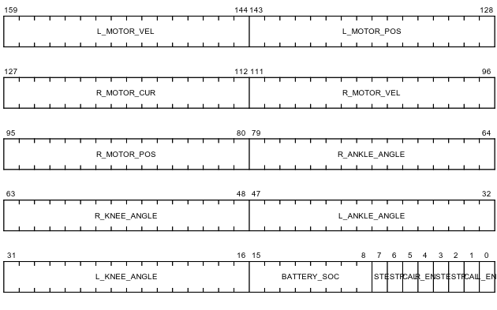
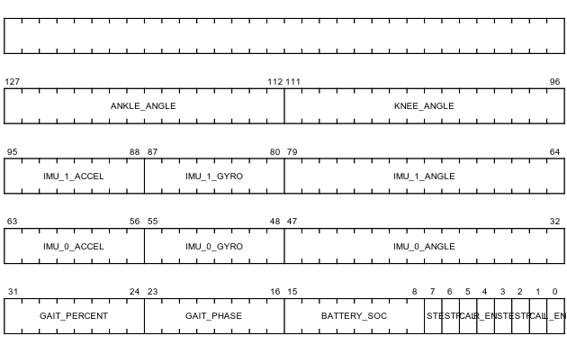
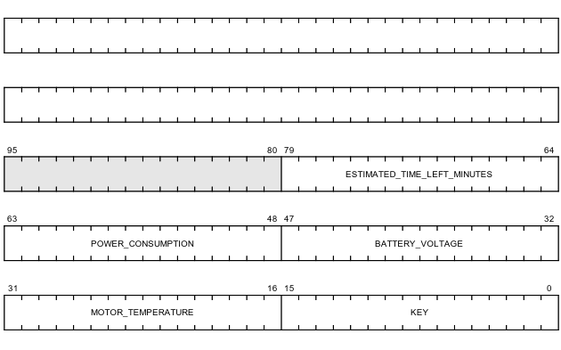
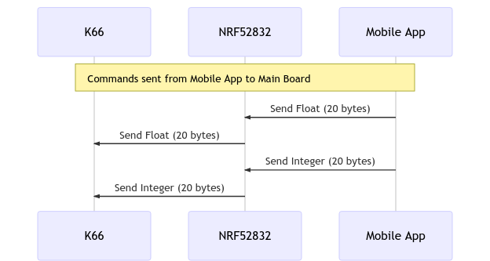
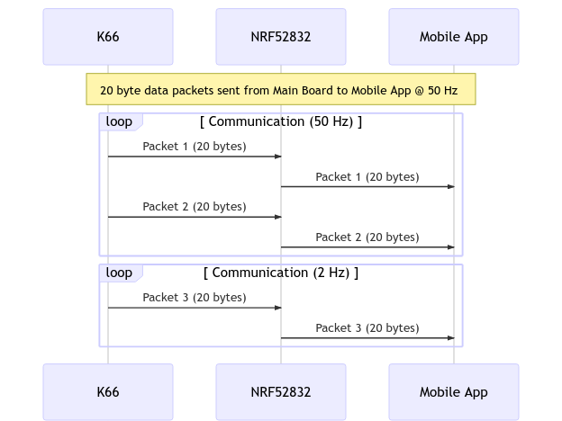
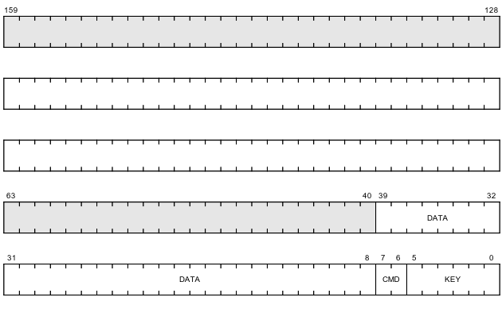

## Mobile App Communication API

(Deprecated as of 12/16/19)

### Tx (Main Board to Mobile App Communication)

Data is sent in 20-byte packets every 20 milliseconds from the **Main Board** to the **NRF52832** bluetooth module via SPI and relayed as BLE packets to the **Mobile App** at the same fixed rate.

Each view on the **Mobile App** requires specific data to be displayed so the data is encoded with packet types which determine the structure.

#### Motor Data Packet

**Motor Data**: includes motor position, velocity, current.

#### Sensor Data Packet

**Gait & Sensor Data**: includes angle, gyro, accelerometer, load cell, gait cycle percent)

#### Status Packet

**System Status Data**: includes battery voltage, power consumption, estimated battery life left, motor temperature.  This packet is sent at a lower frequency 2 Hz as the data changes slowly.

---

### Tx (Android App to Main Board)

Event-driven data is sent in 5-byte packets from the **Mobile App** to the **NRF52832** bluetooth module via BLE and relayed as SPI data to the **Main Board**.

### Rx (Main Board to Android App)

**Command Packet**: The packet includes an identifier in the first 6 bits to determine the type of message and contains 1-4 bytes of data, depending on whether a floating point or integer is sent.  The

---
